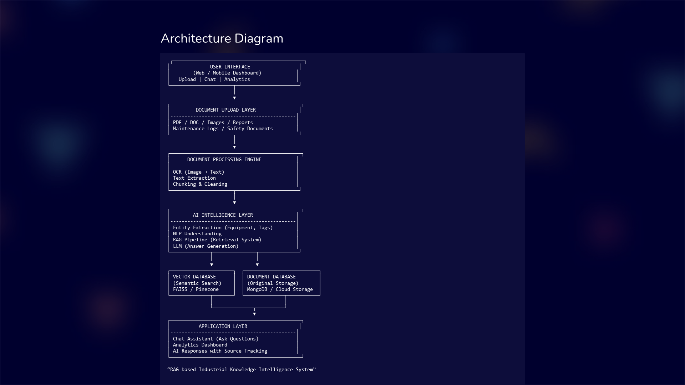

# 🧠 Indus Brain AI  
### Industrial Knowledge Intelligence & Unified Operations Brain

---

## 📌 Problem Statement

In industrial environments, critical knowledge is scattered across multiple disconnected systems such as maintenance logs, safety procedures, inspection reports, manuals, and emails.

This fragmentation leads to:

- ⏳ High time spent searching for information  
- ⚠️ Increased operational and safety risks  
- 🔄 Repeated work and duplicated documentation  
- 📉 Loss of expert knowledge due to workforce retirement  

In real-world industrial setups, even simple queries like  
**“What maintenance was done on Pump A last year?”**  
require searching across multiple systems manually.

---

## 💡 Solution Overview

**Indus Brain AI** is an AI-powered Industrial Knowledge Intelligence system that unifies fragmented industrial data into a single intelligent brain.

It enables:
- Intelligent document ingestion
- AI-powered natural language Q&A
- Semantic search using RAG (Retrieval-Augmented Generation)
- Structured analytics dashboard for insights

---

## 🏗 Architecture

**Pipeline Flow:**
- Document Upload (PDF, logs, manuals)
- OCR & Text Extraction
- Chunking & Processing
- Embedding + Vector Storage
- RAG-based Retrieval
- LLM-based Answer Generation
- Analytics Dashboard

---

## ⚙️ Key Features

- 📂 Multi-format Document Upload (PDF, images, logs)
- 🧠 AI-powered Q&A system using RAG
- 🔍 Semantic search across documents
- 📊 Analytics dashboard with insights
- 🧾 Automatic extraction of maintenance & safety data
- ⚡ Fast retrieval of industrial knowledge

---

## 🖥 System Screenshots

### 📤 Upload System
(Add screenshot)

### 💬 AI Chat Interface
(Add screenshot)

### 📊 Analytics Dashboard
(Add screenshot)

---

## 🧠 Tech Stack

- Frontend: React + Vite  
- Backend: Node.js / FastAPI  
- AI: LLM + RAG Pipeline  
- Vector Database: FAISS / Pinecone  
- OCR: Tesseract / Cloud OCR  
- Storage: MongoDB / Cloud Storage  

---

## 📊 Impact

- 🔻 Reduces information retrieval time by up to 70%  
- 🔺 Improves operational decision-making speed  
- 🛡 Enhances safety compliance and awareness  
- 🧠 Preserves institutional knowledge across teams  
- ⚙️ Reduces downtime caused by missing information  

---

## 🚀 Future Scope

- IoT sensor integration for real-time data ingestion  
- Predictive maintenance engine  
- Voice-enabled industrial assistant  
- Automated compliance report generation  
- Digital twin integration for factories  

---

## 🎥 Demo Video

(https://drive.google.com/file/d/1hRm7NosL1M_8YyIrbJQqi9gMqRAkbHSM/view?usp=drive_link)

---

## 🏁 Conclusion

Indus Brain AI transforms fragmented industrial documentation into a unified, intelligent knowledge system.

It is not just a document management tool —  
it is an **AI-powered brain for industrial operations**.

---

## 🙏 Thank You